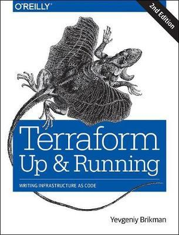

`audio: /text2speech/terraform-is-the-way.wav`

One of my first IT books ever, that i bought myself, was `Terraform Up & Running` by Yevgeniy Birkman. Back in 2017 I somehow got a job as Cloud-Engineer at Siemens, without even realizing what I got myself into. Having just about 2 years of programming experience with some basic Web-Interfaces in a SAP production line ecosystem and no prior expertise of Cloud, IAC, Docker, Microservices, HA, Linux whatsoever. 

Spoiler: This post was deployed without ever using the Azure portal, without manualy touching any resource or doing something other then pushing this `.md-file`.



*Terraform Up & Running Book Cover*


I was facing multiple microservices that wanted to be deployed, a complete new world in the cloud (AWS) and everything needed to be CICD right away. Luckily I got colleagues with more experience to guide and assist me on my way. They helped me exploring the new terrain sharing their knowledge and holding my hand, preventing me to cry in agony.

Fast forward 5 years. Here I am Freelancing as a DevOps/ Cloud-Engineer, crafting multi-region, scalable kubernetes cluster plattforms for customers with ease.

## Cloud-native 

What exactly `<is>` a cloud-native? I claim that a sys-admin thinks and works in a different way then the likes of me.

> When there has to be a change I commit. 

I was trained and molded never to touch a deployed infrastructure. The credo is `NO MANUAL ACTION`. When there is a new feature I deploy the exact same infra alongside the running system, never even touching the current stage. When there has to be a migration, I duplicate, alter and traffic-shift. A running system is a running system, it is finished product, a deliverd package, untouchable. Any change on a running system could potentialy break it and cause downtime. But zero downtime is the goal.

I am (and never was) a sys-admin. But from my perspective it seems that their goal was to adapt, modify and finaly integrate, but on the same product, on the same infrastructure. Maybe they also used stages, but I suggest not thinking in `<stages>`.

> I suggest thinking in untouchable, productive systems that are not allowed to touch, modify or change.

If there is a new version, a new set of features, a new label or title on the page then it is `A NEW PRODUCT` that has to be (one-click) deployable in that exact same state, regardless the stage. 

To be fair, that would be the best of possible worlds, in reality I still do `CI/CD` for development branches. Nobdy rebuilds an AKS cluster (dev) from the scratch when there is a minor change in configuration. But my point is - You always should be able to.

Thats when the power of Terraform comes into play. It's declerative nature forces cloud-developers to think in exactly that manner. No manual changes allowed. To further support that credo I renunciate any other permission in the cloud then `READ-Access`. When I want to change ANYTHING, it has to be done via my checked in code. When I change a database-name or instance-type I need to be aware that terraform would sometimes destroy the old resource and re-create it, just because I changed some configuration. Caution is king.

> You should be able to rebuild your infrastructure from the scratch with a simple click and re-create the exact same state

## Terraform all the things - My Setup

I prefer to organize my projects into a simple `project` uses `n-modules` interpolated by `m-configs` structure.

```
static-web-app-gatsby/
│   README.md
└───configs/
│   │
│   │ dev/release-config.json
│   │ rc/release-config.json
│   │ prod/release-config.json
│
└───terraform/
│   │
│   └───projects/
│   │   │
│   │   └───main/
│   │
│   └───modules/
│       └───static-web-app/
|
└───site/
    │   content/blog/terraform-is-the-way/index.md
    │   gatsby-config.js
    │   package.json
    │   ...
```

## A word about perfection and being intermediate


To be honest I do like polished blog posts with nearly godlike prefect code examples, but the unspoken truth is: nobody works that way. High quality code needs many iterations, revisions and time to grow and mature.

Good code is (often times) not magically woven together like a one-take-music video, and even they have months or even years of planning beforehand.

I would label programming as an creative task. That said I need time and freedom to explore, fail and most importantly figure out how the pieces fit and work togehter.

Yes it requires study - I need to know key-concepts and need to be able to interpolate the conesequences that follow my actions. But that's why there is a happy dev environment to f**k up, to test out small POCs and finally bring it all together into a meaningful whole.

Shoutout to `@NedintheCloud`, who helped me understand using the apex-domain and how to validate SWA ownership in terraform. Check out his youtube video on how-to [Publishing a Static Website With Terraform](https://www.youtube.com/watch?v=Gm4IYMVjzPo&t=716s).

Big shoutout to the [Gatsby Getting-Started Docs](https://www.gatsbyjs.com/docs/how-to/) for doing the heavy lifting of my blog frontend and [Azure Docs](https://learn.microsoft.com/en-us/azure/static-web-apps/apex-domain-azure-dns) for being just good enough to get an rough idea how the infrastructure can be set up.


## Next Up

Up unitl now I still need commits to add a new blog post. My next goal is to add some content-management-system (CMS) to be able to manage my blog posts without touching the code base and have a reasonable distinction between the plattform and the displayed content.

---
<br>
<br>
<br>

- IMPROVE: If you want to dig deeper and check out the code, feel free to browse my public repository (clone/fork) which will be available soon >> TBD >> devops-sushi-gh-org

- IMPROVE: Maybe some tf code examples? ...

- IMPROVE: GH Actions and how I set the CI and api key for the web app code push? 

- ...